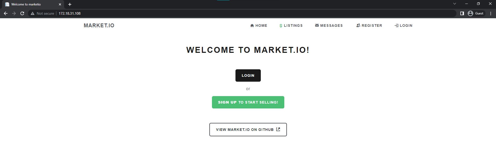
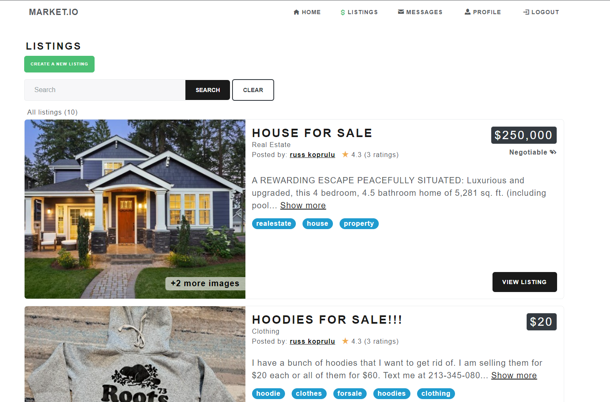

# market.io
### A web application that allows you to connect with users to buy, sell, and advertise items, services, real estate, and many more... 

## Project Overview
market.io allows users to register and login to personal accounts to list their items, homes for sale/rent, jobs, and other types of listings to the public. This includes the ability to enquire and send private chat messages between each other to negotiate and agree upon transactions.

## Project Technologies
- Backend: SQL Entity Framework Core / SQL design with stored proecdures and LINQ
- Frontend: Blazor Web App
- Web API: ASP.NET Core Web API (to handle REST/HTTP operations, token authentication) 

## Software Architechture
### Blazor Server App
- Bootstrap 5
- Login / Register scheme - Custom JWT authentication
- Listings page: All listings with search filtering capabilities
- Listing detail page: brief information about listing, view images, ability to message the person who posted the listing.
- Chat page / chat component: A chat page to display chat messages, an input to send a chat
- Admin page - CRUD operations for users, listings, categories, transactions, messages...

### ASP.NET Core Web API
- REST Operations for data contained in the SQL database
- Auth controller to handle user registration, JWT for user login requests
- RestSharp (https://restsharp.dev/) library for client-side HTTP requests

### 'Common' C# Library 
- Contains models, helper classes/methods
- Used between all applications

### Testing
- Postman API for Web API tests
- GET, PUT, POST, DELETE
